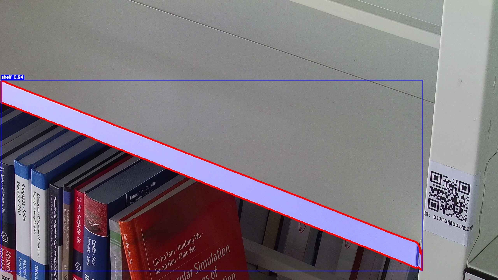

# yolo-seg-ort


<!-- PROJECT SHIELDS -->


<!-- PROJECT LOGO -->
<br />

<p align="center">  <a href="https://github.com/7emotions/yolo-seg-ort/">
  
  </a>
  <h3 align="center">yolo-seg-ort</h3>
  <p align="center">
    采用纯ONNX Runtime实现YOLOv11-seg的onnx模型。<br />
    <a href="https://github.com/7emotions/yolo-seg-ort"><strong>探索本项目的文档 »</strong></a><br />
    <br />
    <a href="https://github.com/7emotions/yolo-seg-ort/releases">查看发布</a>
    ·
    <a href="https://github.com/7emotions/yolo-seg-ort/issues">报告Bug</a>
    ·
    <a href="https://github.com/7emotions/yolo-seg-ort/issues">提出新特性</a>
  </p>
</p>

## 1. 模型转换

```python

from ultralytics import YOLO

# Load the YOLO11 model
model = YOLO("best.pt")

# Export the model to ONNX format
model.export(format="onnx")  # creates 'yolo11n.onnx'

```

## 2. 安装依赖

```bash
pip install -r requirements.txt
```

## 3. 用法

```python
import cv2
from yolo_seg_ort.core import YOLOSeg


def main():
    image_path = "./images/test.jpg"
    try:
        image = cv2.imread(image_path)
        if image is None:
            raise FileNotFoundError(f"无法加载图像：{image_path}。请检查路径是否正确。")
    except Exception as e:
        print(f"加载图像时发生错误：{e}")
        print("请确保您有一个可用的图像文件路径，例如 'sample_image.jpg'")
        return

    onnx_path = "./models/best.onnx"

    try:
        model = YOLOSeg(onnx_model=onnx_path)
    except Exception as e:
        print(f"加载 ONNX 模型时发生错误：{e}")
        print("请确保您有一个有效的 ONNX 模型文件路径，例如 'best.onnx'")
        return

    print("模型加载成功，正在进行推理...")
    result = model(image)

    if result:
        result[0].save("./results.jpg")
    else:
        print("未检测到任何对象或结果为空。")


if __name__ == "__main__":
    main()
```

## 4. 结果



## 5. 贡献者

[7emotions](https://github.com/7emotions)

## 6. 许可证

本项目采用 MIT 许可证。有关详细信息，请查看 [LICENSE](LICENSE) 文件。
